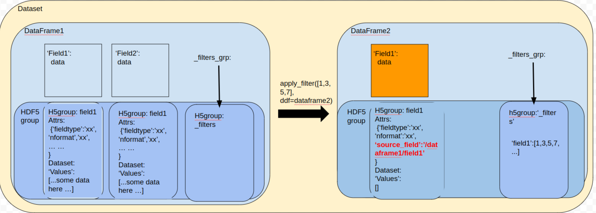
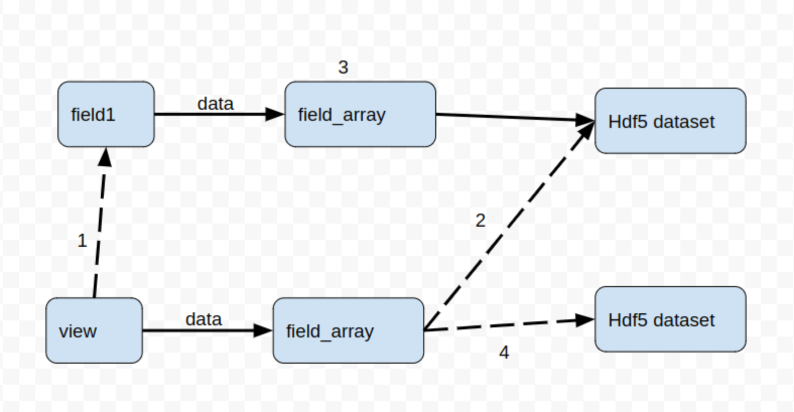

# View
## what is a view
A view is a special field that has a ‘source_field’ in it’s hdf5 attributes. In this case, the view will initialize the dataset from the destination specified by the ‘source_field’ rather than in it’s own hdf5 storage.

The benefit of using a view is to reduce disk IO during apply_index and apply_filter operations. The index or filter will be stored in the dataframe, the view can read from the source field and combing the index or filter to achieve the filtering operation without writing an extra copy of data.

Specifically, the dataframe._filters_grp is the hdf5 group where the index or filters are stored. The boolean filter will be transferred as an integer index during apply_filter function. The index filter is stored as a NumericField in the dataframe._add_view function.

## How to generate a view

The user can either 1) call apply_filter or apply_index to generate views with index filters, 2) or simply call dataframe.view() to generate views without index filters. The internal function is dataframe._add_view() which take care the construction. Please note the view can only be created from the field that co-exist in the same dataset/file, as associate view with field from a different file will bring lots of uncertainty.

The view is only a special instance of field, so that the construction is similar: 1) call the field.base_view_constructor to setup the h5group and, 2) call the specific field type constructor to initialize the field instance. However, there is also a special action, that is 3) attach the view to the source field so that the source field can notify the view if the underly data is changed. These three actions can be seen from in the upper part from dataframe._add_view().

You can tell if a field is a view by field.is_view(), this method will check the ‘source_field’ attributes in the field’s hdf5 group. If this attribute is present, then this field is a view.

## Fetch data from a view
As a view is just like a field to users, you can still use field.data[:] to fetch the data from the view. In the field implementation, the member  ‘data’ is a FieldArray. Hence, the difference of a view and field is during the initialization of the FieldArray. Normally, FieldArray will load hdf5 dataset of the current hdf5 group (where field is stored); however in case of a view, the FieldArray will load data from the hdf5 group specified by the ‘source_field’ attribute.

Also in the case of where there is a filter/index for this view (field.filter is not None), the FieldArray will fetch the filter/index first and mask the underlying data first. These can be found on FieldArray.__getitem__ or IndexFieldArray.__getitem__ for indexed string.

## Life-cycle of a view
### A view from a field
Step0: you have a field in the dataframe, and called dataframe.apply_filter(), apply_index() or view()

Step1: the view will be created and attach to the source field. The attach method is in the field, but call in dataframe._add_view.

Step2: When the view.data is called, the view will initialize a FieldArray that point to the soure field rather than it’s own dataset.

Step3: When the field.data.write or field.data.clear is called, means the data will be modified, the data.write or data.clear will call field.update() to notify the field of the action. And then the field will pass the notification to the views in field.notify(). Once received the notification, the view.update() can perform certain actions.

Step4: At the moment, the view.update() will copy the original data to it’s own dataset, , re-initilize the data interface and delete the ‘source_field’ attribute (so that it’s not a view anymore).

### An existing view
As the view is stored in the hdf5, the view relationship can be presistenced over sessions. Upon loading a dataset (in dataset.__init__), the dataset will check if there is a view and call dataframe._bind_view() to attach the view to the field during initialization of dataset/dataframe/fields. This is why the view can only be created from a field that co-exist in the same dataset (hdf5 file).
